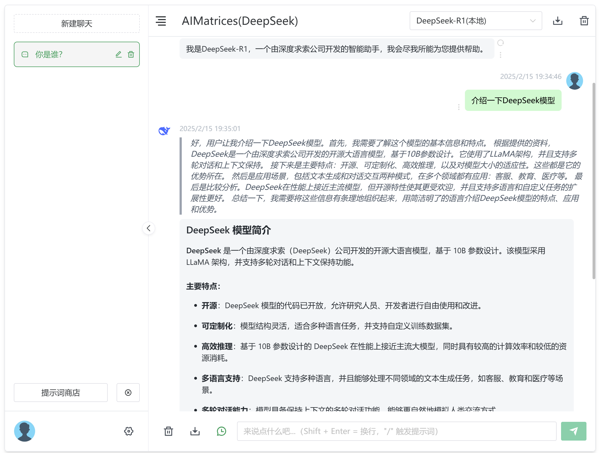

AIMatrices
==============

AIMatrices 是一款轻量级、高性能、可扩展、开源的AI应用快速构建平台，旨在为开发者提供高效、便捷的 AI 应用开发体验。它通过集成多种先进的技术和工具，帮助用户快速搭建、部署和维护 AI 应用，无需从零开始编写复杂的代码。

> [!WARNING]
> AIMatrices 是一个实验性的软件包。它可能会发生变化，仅用于评估目的。

## 特性

## 文档

## 实际案例

* [AIMatrices DeepSeek](https://github.com/guyoung/AIMatrices/tree/main/packages/ai-matrices-deepseek)

* [AIMatrices Flux](https://github.com/guyoung/AIMatrices/tree/main/packages/ai-matrices-flux)

## 常见问题

## 获取帮助

GitHub [Issues](https://github.com/guyoung/AIMatrices/issues) 提交 bug 和功能请求

## 许可证

本项目采用 [Apache License 2.0](LICENSE)

