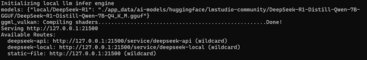

AIMatrices DeepSeek
=========================

AIMatrices DeepSeek 是一款基于轻量级 AI 应用快速构建平台 AIMatrices 开发的开源 DeepSeek 本地化部署工具，支持本地模型、远程 API 灵活切换，旨在为用户提供高效、灵活且低成本的 DeepSeek 大模型部署解决方案。


## 功能特性

**开箱即用**

使用 Rust 编程语言开发，直接编译成二进制可执行文件，生成的可执行文件大小约为 40MB左右，无需安装任何外部依赖库，极大地简化了部署过程，无需使用容器即可在多种操作系统（如 Windows、macOS、Linux）上运行。

**广泛硬件平台支持**

通过 Rust 的 FFI 技术调用高性能的 llama.cpp 库，并以 Vulkan 作为后端进行模型推理，支持NVIDIA、AMD 、Intel等多种主流显卡，能够为模型推理提供显著的GPU加速效果，这种架构设计使得项目能够充分利用现代 GPU 的强大计算能力，同时保持良好的跨平台兼容性。

**多模型支持与灵活切换**

支持多种 DeepSeek-R1-Distill-Qwen 模型版本，包括 1.5B、7B、14B 等，用户可以根据硬件配置选择合适的模型进行本地部署，以满足对数据隐私和性能的双重需求，同时支持通过远程 API 调用 DeepSeek 模型服务，无需本地硬件支持。用户可以根据实际需求灵活切换本地模型和远程 API，实现高效部署和资源优化。

**安全高效**

使用 Rust 编程语言基于 AIMatrices 平台开发，确保应用在不同设备和操作系统上都能安全高效运行。Rust 的所有权系统和生命周期检查机制从根本上杜绝了空指针、数据竞争、内存泄漏等常见错误，使得程序在编译阶段就能发现大部分潜在的内存问题，从而减少运行时错误和崩溃。Rust 的性能接近于 C/C++，同时避免了垃圾回收机制的开销。它通过零成本抽象和高效的编译器优化，确保代码执行效率极高。

**灵活配置与组件化**

采用 WebAssembly 组件技术，通过应用配置文件定义应用的组件、路由规则、环境变量等配置信息，实现高度灵活的组件化开发。例如，可通过配置 allowed_outbound_hosts 控制组件的外部请求权限，或通过文件映射实现静态资源托管。

**可扩展性与自定义能力**

遵循 OpenAI API 规范进行模型 API 调用，通过标准化的接口参数，如输入文本、模型选择、温度参数等，实现对模型的调用和结果获取，除 DeepSeek 模型外，还支持使用其他OpenAI API 模型 。同时支持使用 JavaScript 代码进行自定义扩展，允许用户根据业务需求实现个性化的逻辑处理。

**用户界面友好**

支持多国语言切换，用户可以根据自语言偏好选择界面语言，确保使用体验的便捷性和舒适性。前端页面采用了响应式设计，能够根据设备屏幕大小自动调整布局和元素大小，确保在手机、平板等移动设备上也能提供清晰、流畅的视觉效果，提供更好的移动端体验。

**完全开源**

AIMatrices DeepSeek 是一个开源项目，开发者可以自由访问其代码，进行定制和扩展。


## 快速开始

### 安装

#### 方式一：直接下载可执行文件

从 AIMatrices [GitHub Release](https://github.com/guyoung/AIMatrices/releases) 下载 ai-matrices-deepseek 对应系统版本，解压后即可使用

#### 方式二：源码编译

编译前提条件是需要安装 Rust 环境

```shell


git clone https://github.com/guyoung/AIMatrices.git

## 编译 AIMatrices DeepSeek 主程序
cd AIMatrices/packages/ai-matrices-deepseek
cagro build -- release

## 编译 AIMatrices WebAssembly 组件
cd AIMatrices/components/llm-handler-component
cargo component build --release
cd AIMatrices/components/llm-local-handler-component
cargo component build --release
cd AIMatrices/components/static-file-handler-component
cargo component build --release
```

### 下载模型

* DeepSeek-R1-Distill-Qwen-7B-GGUF
    * https://huggingface.co/lmstudio-community/DeepSeek-R1-Distill-Qwen-7B-GGUF/DeepSeek-R1-Distill-Qwen-7B-Q4_K_M.gguf
    * mirror: https://hf-mirror.com/lmstudio-community/DeepSeek-R1-Distill-Qwen-7B-GGUF/DeepSeek-R1-Distill-Qwen-7B-Q4_K_M.gguf

可以根据运行计算机实际情况，选择其他模型

### 配置

如需运行本地模型，需要修改应用配置文件中本地模型相关信息，打开 app_data 目录下 app-config.json 文件，修改模型路径。

```json
{
    "id": "deepseek-local",
    "metadata": {
      "build": {},
      "local_llm_models": {
        "local/DeepSeek-R1": "./app_data/ai-models/huggingface/lmstudio-community/DeepSeek-R1-Distill-Qwen-7B-GGUF/DeepSeek-R1-Distill-Qwen-7B-Q4_K_M.gguf"
      }
    },
    "source": {
      "content_type": "application/wasm",
      "source": "./app_data/components/ai_matrices_llm_local_handler_component.wasm"
    }
}
```
local/DeepSeek-R1 为 model_id，值为模型所在路径。

可以同时配置多个本模型。
```json
{
  "local_llm_models": {
    "local/DeepSeek-R1-7B": "./app_data/ai-models/huggingface/lmstudio-community/DeepSeek-R1-Distill-Qwen-7B-GGUF/DeepSeek-R1-Distill-Qwen-7B-Q4_K_M.gguf",
    "local/DeepSeek-R1-0.5B": "./app_data/ai-models/huggingface/lmstudio-community/DeepSeek-R1-Distill-Qwen-0.5B-GGUF/DeepSeek-R1-Distill-Qwen-7B-Q4_K_M.gguf"
  }
}
```

如为源码编译安装，还需修改 WebAssembly 组件文件位置
```json
{
  "source": {
    "content_type": "application/wasm",
    "source": "./app_data/components/ai_matrices_llm_local_handler_component.wasm"
  }
}
```

打开 app_data/codes/deepseek-api 目录下 index.js 文件，修改本地模型和远程 API 配置信息。
```javascript
const models = {
  "local/deepseek-r1": {
    name: "DeepSeek-R1(本地)", 
    model: "local/DeepSeek-R1", 
    local: true,
    url: "/service/deepseek-local",
    api_key: ""
  },
  "deepseek-chat": {
    name: "DeepSeek Chat", 
    model: "deepseek-chat", 
    local: false,
    url: "https://api.deepseek.com",
    api_key: "sk-********************************"
  },

  "deepseek-reasoner": {
    name: "DeepSeek Reasoner", 
    model: "deepseek-reasoner", 
    local: false,
    url: "https://api.deepseek.com",
    api_key: "sk-********************************"
  },
  "siliconflow/deepseek-v3": {
    name: "DeepSeek-V3(硅基流动)", 
    model: "deepseek-ai/DeepSeek-V3", 
    local: false,
    url: "https://api.siliconflow.cn/v1",
    api_key: "sk-********************************"
  },
  "siliconflow/deepseek-r1": {
    name: "DeepSeek-R1(硅基流动)", 
    model: "deepseek-ai/DeepSeek-R1", 
    local: false,
    url: "https://api.siliconflow.cn/v1",
    api_key: "sk-********************************"
  },
}

```

key 为 model_id，local 值 true 为本地模型，本地模型 model_id 与 name 保持一致，远程 API model 和 url 查看 API 文档，远程 API 需配置 api_key。

如果使用其他网址 API， 需修改 deepseek-api 组件 allowed_outbound_hosts 值，打开 app_data 目录下 app-config.json 文件。

```json
{
  "id": "deepseek-api",
  "metadata": {
    "build": { },
    "allowed_outbound_hosts": [
      "http://self",
      "https://api.deepseek.com",
      "https://api.siliconflow.cn"
    ],

    "key_value_stores": [
      "default"
    ]
  },
  "source": {
    "content_type": "application/wasm",
    "source": "../../target/wasm32-wasip1/release/ai_matrices_llm_handler_component.wasm"
  }
}
```


### 运行应用

Windows 命令行运行
```shell
ai-matrices-deepseek-windows-amd64.exe
```

Linux 命令行运行

```shell
./ai-matrices-deepseek-linux-amd64
```



命令行参数：
* -i,--ip <port_number>: 指定服务器监听的 IP 地址，默认为 127.0.0.0。
  * example: --ip 0.0.0.0
* -p,--port <port_number>: 指定服务器监听的端口号，默认为 21500。
  * example: --port 3000
* --appdir <appdir>: 指定工作目录，默认值为 ./app_data
  * example：--app-dir ./dir1
* --appconfig <appconfig>: 指定应用配置文件，默认值为 ./app_data/app-config.json
  * example：--appconfig ./dir1/config.json
* --user <username>: 指定登录用户名，默认值为空
  * example：--user admin
* --pass <password>: 指定登录用户密码，默认值为空
  * example：--pass admin
* --version: 打印系统版本号并退出。
* --help: 查看命令的使用帮助和参数说明。

```shell
ai-matrices-deepseek-windows-amd64.exe -i 0.0.0.0 -p 8080 --user admin -- pass admin
```

## 其它

AIMatrices DeepSeek 前端程序使用了 [chatgpt-web](https://github.com/Chanzhaoyu/chatgpt-web) 项目代码。